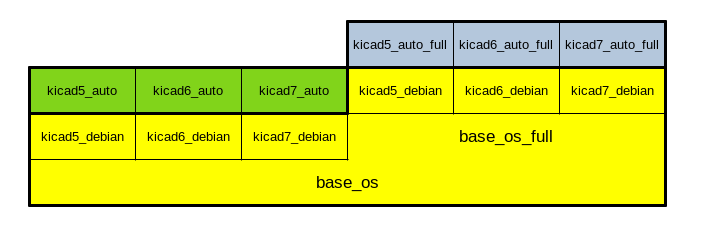

# kicad_debian

Docker image for KiCad on Debian GNU/Linux.

The main objetive is to use it as a base for [KiBot (KiCad automation in CI/CD environments)](https://github.com/INTI-CMNB/KiBot).

The images are uploaded to [Docker Hub](https://hub.docker.com/repository/docker/setsoft/kicad_debian) and
the GitHub packages [kicad5_debian](https://github.com/INTI-CMNB/kicad_debian/pkgs/container/kicad5_debian),
[kicad6_debian](https://github.com/INTI-CMNB/kicad_debian/pkgs/container/kicad6_debian) and
[kicad7_debian](https://github.com/INTI-CMNB/kicad_debian/pkgs/container/kicad7_debian).

The current tags at GitHub are:

## KiCad 5

* **ghcr.io/inti-cmnb/kicad5_debian:5.1.6_d10.4** KiCad 5.1.6 (backport) on Debian 10.4
* **ghcr.io/inti-cmnb/kicad5_debian:5.1.9_d10.4** KiCad 5.1.9 (backport) on Debian 10.4
* **ghcr.io/inti-cmnb/kicad5_debian:5.1.9_d11.5** KiCad 5.1.9 on Debian 11.5
* **ghcr.io/inti-cmnb/kicad5_debian:5.1.9_d11.6** KiCad 5.1.9 on Debian 11.6

## KiCad 6

* **ghcr.io/inti-cmnb/kicad6_debian:6.0.0_u21.10** KiCad 6.0.0 on Ubuntu Impish (21.10)
* **ghcr.io/inti-cmnb/kicad6_debian:6.0.2_d11.2** KiCad 6.0.2 (backport) on Debian 11.2
* **ghcr.io/inti-cmnb/kicad6_debian:6.0.4_d11.3** KiCad 6.0.4 (backport) on Debian 11.3
* **ghcr.io/inti-cmnb/kicad6_debian:6.0.5_d11.3** KiCad 6.0.5 (backport) on Debian 11.3
* **ghcr.io/inti-cmnb/kicad6_debian:6.0.6_d11.4** KiCad 6.0.6 (backport) on Debian 11.4 (6.0.7 libs)
* **ghcr.io/inti-cmnb/kicad6_debian:6.0.7_d11.5** KiCad 6.0.7 (backport) on Debian 11.5
* **ghcr.io/inti-cmnb/kicad6_debian:6.0.8_d11.5** KiCad 6.0.8 (backport) on Debian 11.5
* **ghcr.io/inti-cmnb/kicad6_debian:6.0.9_d11.5** KiCad 6.0.9 (backport) on Debian 11.5
* **ghcr.io/inti-cmnb/kicad6_debian:6.0.10_d11.6** KiCad 6.0.10 (backport) on Debian 11.6
* **ghcr.io/inti-cmnb/kicad6_debian:6.0.11_d11.6** KiCad 6.0.11 (backport) on Debian 11.6

## KiCad 7

* **ghcr.io/inti-cmnb/kicad7_debian:7.0.1.1_d11.6** KiCad 7.0.1.1 on Debian 11.6

Note: 7.0.1.1 add the following patches to 7.0.1:
- [Load the global fp-lib-table before running the Python DRC](https://gitlab.com/kicad/code/kicad/-/merge_requests/1536)
- [Adds the missing plot formats to `kicad-cli sch export`](https://gitlab.com/kicad/code/kicad/-/merge_requests/1529)


Originally the installations were minimal, but starting with 6.0.11 they contain the KiBot and other plug-in dependencies.
This was done to reduce the differences between KiBot docker images.

The 3D models aren't included, they weight 10 times the size of these images (makes them 2.5 bigger when compressed),
a script called `kicad_3d_install.sh` is included, run it to install the libraries. Note that KiBot downloads the 3D models on-demand.

If you want to run KiCad interactively from the image use:

```
export USER_ID=$(id -u)
export GROUP_ID=$(id -g)
docker run -it -v /tmp/.X11-unix:/tmp/.X11-unix -e DISPLAY=$DISPLAY \
    --user $USER_ID:$GROUP_ID \
    --env NO_AT_BRIDGE=1 \
    --workdir="/home/$USER" \
    --volume="/etc/group:/etc/group:ro" \
    --volume="/home/$USER:/home/$USER:rw" \
    --volume="/etc/passwd:/etc/passwd:ro" \
    --volume="/etc/shadow:/etc/shadow:ro" \
    --volume="/home/$USER:/home/$USER:rw" \
    ghcr.io/inti-cmnb/kicad7_debian:latest kicad
```

Various script examples are included in this repo.

The images are used to create KiBot images that you can find in the [kicad_auto](https://github.com/INTI-CMNB/kicad_auto)
and [kicad_auto_test](https://github.com/INTI-CMNB/kicad_auto_test) project. The relation between the images is as depicted in
the following image:



Note that now we also have images tagged with `*_full` these images contains some heavy tools used by KiBot, they include:

- Blender 3.4
- Pandoc
- LaTeX
- Python test tools

These images are the base for [kicad_auto_test](https://github.com/INTI-CMNB/kicad_auto_test) images (aka **kicad_auto_full**)
